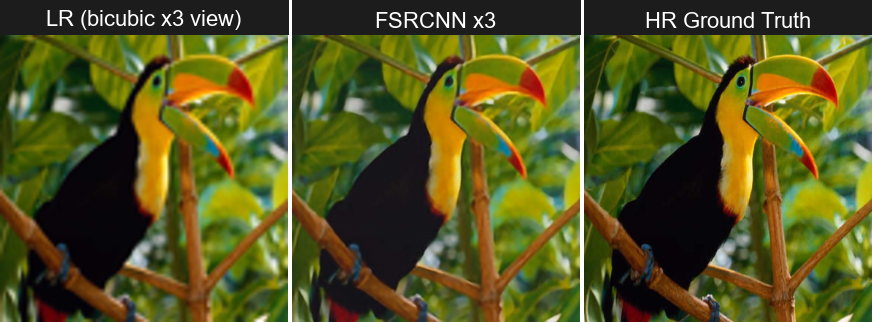

# FSRCNN-Y x3 PyTorch

Dự án này cài đặt và demo mô hình **FSRCNN x3** cho bài toán single image/video super-resolution. Phiên bản hiện tại tập trung vào pipeline **Y-channel**: mô hình dự đoán kênh Y, còn hai kênh màu Cb/Cr được upscale bằng Bicubic rồi ghép lại thành ảnh/video RGB/BGR.

## Chức năng chính

- Chạy super-resolution cho ảnh bằng Gradio UI.
- Chạy super-resolution cho video và xuất video FSRCNN-Y x3.
- Webcam demo/benchmark với FSRCNN-Y x3.
- Inference riêng cho Set5 và Set14.
- Train/validate FSRCNN x3 trên tập dữ liệu tùy chỉnh.

## Cấu trúc thư mục

```text
.
|-- app.py                    # Gradio app: image, video, webcam SR
|-- model.py                  # Kiến trúc FSRCNN
|-- train.py                  # Train model
|-- validate.py               # Validate model
|-- dataset.py                # Dataset loader
|-- imgproc.py                # Xử lý ảnh và chuyển đổi màu
|-- config.py                 # Cấu hình train/valid
|-- inference_set5_y.py        # Inference Set5 bằng FSRCNN-Y x3
|-- inference_set14_y.py       # Inference Set14 bằng FSRCNN-Y x3
|-- benchmark_video_y.py       # Benchmark video HR -> LR -> SR
|-- benchmark_webcam_y.py      # Benchmark webcam
|-- realtime_camera_y.py       # App webcam/video local
|-- scripts/                  # Script chuẩn bị dataset
|-- assets/                   # Ảnh nhỏ cho README/demo
|-- data/                     # Dataset/video local
|-- results/                  # Checkpoint train
|-- pretrained/               # Weight pretrained
`-- outputs*/                 # Kết quả inference/benchmark
```

## Cài đặt

Tạo môi trường Python rồi cài dependency:

```bash
pip install -r requirements.txt
```

Nếu chạy train/inference bằng GPU, hãy cài bản PyTorch phù hợp với CUDA trên máy của bạn theo hướng dẫn từ trang PyTorch.

## Tải dữ liệu và checkpoint

- `data/`: Set5, Set14, TrainMixed, video test như `data/videos/test_hr.mp4`
- `results/`: checkpoint từ quá trình train
- `pretrained/` hoặc `weights/`: weight pretrained
- `outputs/`, `outputs_hf/`, `samples/`: kết quả sinh ra khi chạy app/inference/benchmark

Đặt checkpoint FSRCNN-Y x3 vào một trong các vị trí sau:

```text
best_epoch300_psnr3299.pth.tar
best.pth.tar
weights/best_epoch300_psnr3299.pth.tar
weights/best.pth.tar
results/fsrcnn_y_x3_pretrained_mixed/best_epoch300_psnr3299.pth.tar
results/fsrcnn_y_x3_pretrained_mixed/best.pth.tar
```

Nếu dùng các script inference/benchmark hiện tại, đường dẫn mặc định là:

```text
results/fsrcnn_y_x3_pretrained_mixed/best_epoch300_psnr3299.pth.tar
```

## Chạy Gradio app

```bash
python app.py
```

App có 3 tab:

- Image Super-Resolution
- Video Super-Resolution
- Real-time Webcam

Kết quả video/ảnh sinh ra sẽ nằm trong `outputs_hf/`.

## Chạy inference Set5 / Set14

Cần có dataset theo đúng cấu trúc:

```text
data/Set5/LRbicx3
data/Set5/GTmod12
data/Set14/LRbicx3
data/Set14/GTmod12
```

Lệnh chạy:

```bash
python inference_set5_y.py
python inference_set14_y.py
```

Kết quả được lưu vào:

```text
outputs/set5_y_x3_final_best/
outputs/set14_y_x3_final_best/
```

## Benchmark video

Script `benchmark_video_y.py` đánh giá FSRCNN-Y x3 trên video HR. Script sẽ tạo LR giả lập từ HR, chạy FSRCNN, tính FPS/PSNR-Y/SSIM nếu có `scikit-image`, và lưu frame so sánh.

Ví dụ với `test_hr.mp4`:

```bash
python benchmark_video_y.py --video data/videos/test_hr.mp4 --frames 100
```

Chạy full video:

```bash
python benchmark_video_y.py --video data/videos/test_hr.mp4 --frames 0
```

Kết quả lưu tại:

```text
outputs/video_benchmark/
```

## Benchmark webcam

```bash
python benchmark_webcam_y.py --camera 0 --frames 100 --width 256
```

Nếu muốn hiện preview:

```bash
python benchmark_webcam_y.py --camera 0 --frames 100 --width 256 --show
```

Kết quả lưu tại:

```text
outputs/webcam_benchmark/
```

## Train

Cấu hình train nằm trong `config.py`. Mặc định project đang dùng:

- `upscale_factor = 3`
- `mode = "train"`
- train data: `data/TrainMixed/FSRCNN/train`
- valid data: `data/TrainMixed/FSRCNN/valid`
- resume checkpoint: `results/fsrcnn_y_x3_pretrained_mixed/best_epoch300_psnr3299.pth.tar`

Chạy train:

```bash
python train.py
```

Nếu muốn validate, sửa `mode = "valid"` trong `config.py`, kiểm tra lại `model_path`, rồi chạy:

```bash
python validate.py
```


```text
Dataset/checkpoint Google Drive: <https://drive.google.com/drive/folders/1clL6bK0NWNm8dM8SaetrDVE2Aaz8X6e6?usp=drive_link>
```

## Kết quả mẫu

Ví dụ super-resolution với ảnh `bird.png` trong tập Set5:

Low Resolution / FSRCNN x3 / High Resolution

<p align="center">
  
</p>

## Credit

Project dựa trên:

**FSRCNN-PyTorch/Lornatang trên GitHub

**Accelerating the Super-Resolution Convolutional Neural Network**  
Chao Dong, Chen Change Loy, Xiaoou Tang

- Paper: https://arxiv.org/abs/1608.00367
- Original Caffe implementation: https://drive.google.com/open?id=0B7tU5Pj1dfCMWjhhaE1HR3dqcGs
